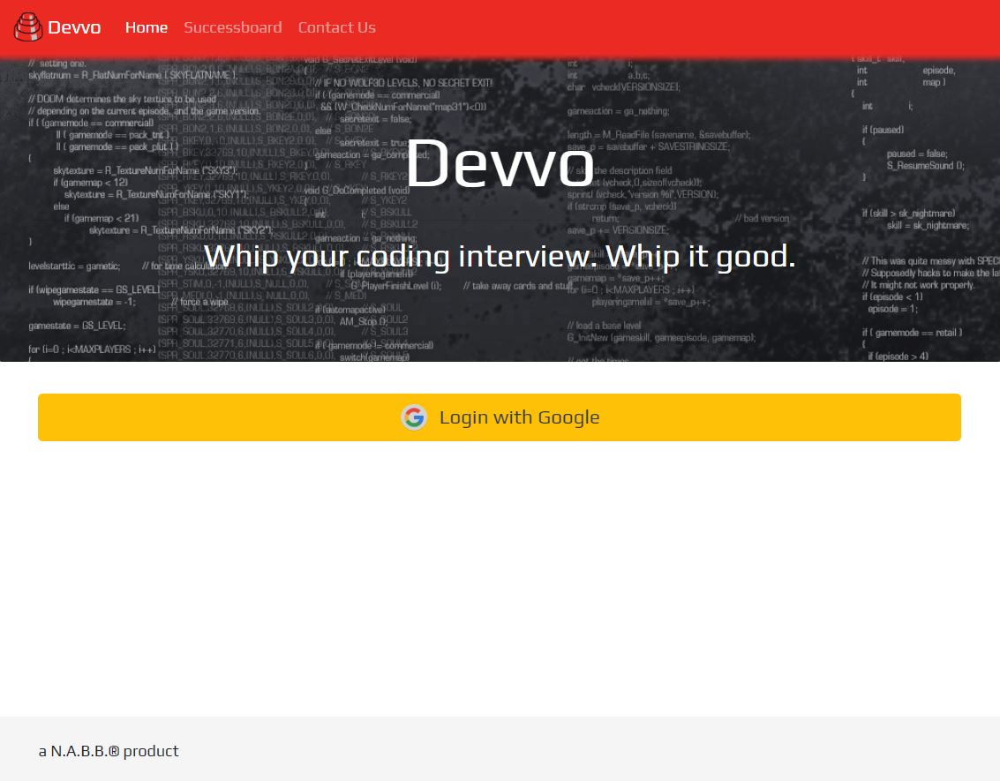
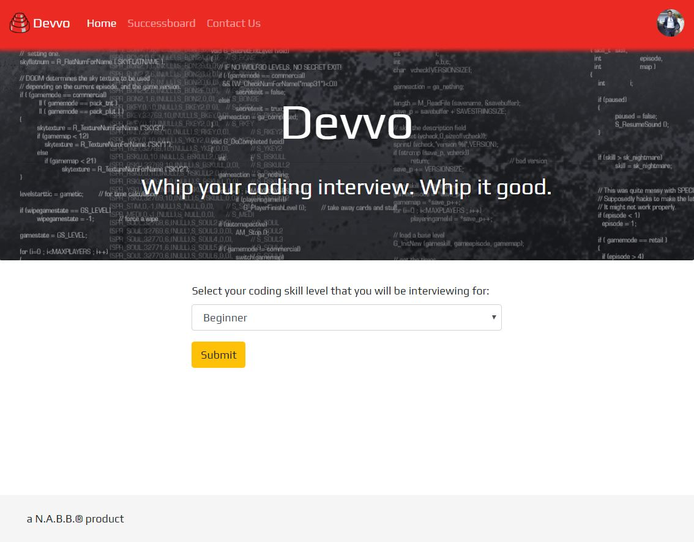
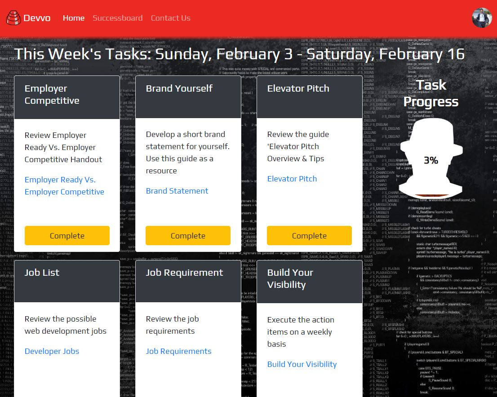

# devvo

Devvo is a playful, mobile friendly, devo themed task manager to help guide coders to prepare for coding interviews. Built with MySQL, Node, Express, Sequelize, Handlebars, Bootstrap, JQuery, Chart.js, and Date.js. This application follows the MVC design pattern. Node and MySQL are used to query and route data into the application, and Handlebars is used to generate the HTML. 

The deployed application can be found [here](https://devvo-nabb.herokuapp.com/).

## Steps to use application

1. When first visiting the website the application will ask the user to `login` with a google account.

    

2. After logging in the user will be asked to select the `skill level` for the job they will be interviewing for.

    

3. After selecting the `skill level` and hitting the `submit` button the user will be directed to the `tasks` page. The user will also be directed here if they have already logged into the site. If beginner is selected as the skill level then only the beginner level tasks will be shown to the user until those tasks are completed. The user's progress will be shown on the right hand part of the screen on larger screens and at the top on mobile devices. 

    

4. Each task is seperated into cards and contains useful links to help complete the task. Hit the completed button on the task when the task is completed. When completed the task will be removed, a devo clip will be played, the progress bar will updated accordingly, and a new task will appear at the end of the list. 

    

5. Using the nav bar you can navigate to the `Successboard` page which displays other developers that have completed their interview prep, top 5 developers that are in progress, and your progress in each category of task. 

    

6. Using the nav bar you can navigate to the `Contact Us` page which allows users to contact Devvo with any questions or comments. 

    

7. The user can `log off` by clicking their `profile picture` on the right side of the upper nav bar. Doing so will bring them back to the login screen. 

    